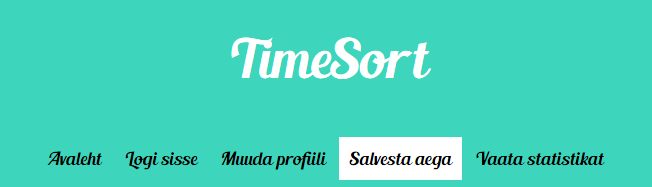
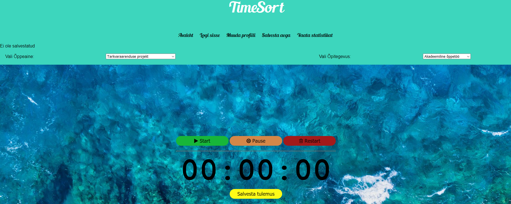
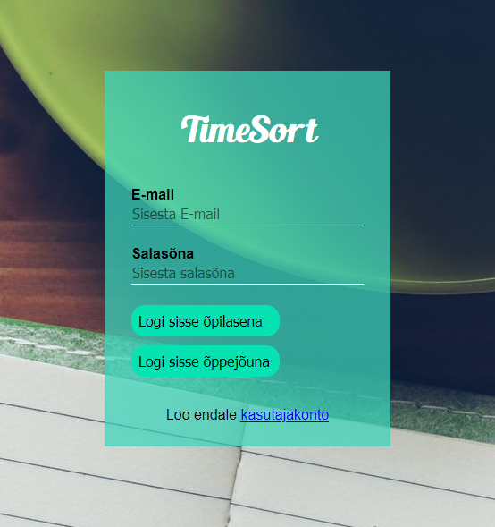

# TimeSort veebirakendus - Tarkvara projekt 2020 
TimeSort veebirakendus on loodud tarkvara arenduse projekti raames Tallinna Ülikooli, Digitehnoloogiate Instituudi, neljaliikmelise meeskonna poolt. Eesmärgiks on jälgida ja sisestada tudengite aega. Sellest tulenevalt saaks õppejõud tagasisidet enda kursuse raames ning tudengid ei jääks ajahätta, sest rakendus aitab ka aega planeerida.

## Meeskond
1) Henri Mägi
2) Henry Pajuri
3) Karl Aleksander Leoste
4) Robin Kadakas

## Kuvatõmmised veebirakendusest
 
 
 


## Paigaldusjuhiseid ja arenduskeskkonna ülesseadmise juhised
Vaja läheb internetti, tuleb üles seadistada kohalik host (local host) kasutades kas [XAMPP](https://premium.wpmudev.org/blog/setting-up-xampp/) tarkvara või midagi muud. Juhul kui server olemas, saab kasutada [PuTTY](https://www.putty.org/) terminali serveriga suhtlemiseks ning koos [WinSCP](https://winscp.net/eng/download.php) tarkvaraga saab tegeleda failihaldusega. Kui on serveriga ühendus tehtud tuleb PuTTY terminalis navigeerida sobivasse kausta ning käsureale kirjutada "git clone https://github.com/henrimag/projekt.git". Selle tulemusena tehakse koopia meie rakendusest ning siis ei jää muud üle kui seadistada Veebibrauseris proxy ning sisestada aadressiribale serveri URL koos teekonnaga.


## Kasutatud tehnoloogiad
1) Visual Studio Code - versioon 1.46.0
2) PuTTY - versioon 0.72
3) WinSCP - versioon 5.15.3
4) XAMPP - versioon 7.4.6
5) SimpleSAMLphp - versioon 1.14.17
6) phpMyAdmin - versioon 4.4.15.10

## Andmebaasi loomine
[Tabel] (https://github.com/henrimag/projekt/blob/master/database/TimeSort_create.sql)

## Veebiserver / andmebaasi server informatsioon
Andmebaasi server
1) Server type: MariaDB
2) Server version: 10.2.25-MariaDB - MariaDB Server
3) Protocol version: 10
4) Server charset: UTF-8 Unicode (utf8) 

Veebiserver
1) Apache/2.4.6 (CentOS)
2) PHP extension: mysqli
3) PHP version: 5.6.40

## Setup peale kloonimist

Tee fail `config.php` projekti baaskausta järgmise sisuga:
```
<?php
	$serverHost = "host";
	$serverUsername = "user";
	$serverPassword = "pass";
	$database = "database"; 
```


## Uue lehe lisamine

Mõned asjad, mida uue lehe lisamisel silmas hoida

### Universaalne head
Kuna <head></head> on suuresti sama sisuga, on tehtud funktsioon selle genereerimiseks, mida saab lehe koostamisel kasutada. Selleks:
1) Faili kõige üleval tuleb requireda `page_loading.php` funktsiooni kasutamist, nt nii: `<?php require('../../functions/page_loading.php'); ?>`
2) Selle asemel, et käsitsi kirjutada <head></head>, kutsu esile hoopis funktsioon: `<?php display_head("Test leht", "See ei ole saidi avaleht"); ?>`
3) Funktsiooni esimene parameeter on lehe title ja teine parameeter description, asenda need vastavalt vajadusele ära

### Universaalne menüü
Kui lehel on vaja menüüd, kust saab minna kõikidele teistele lehtedele, siis tee nii:
1) Require `page_loading.php` , nagu eelmise ploki esimeses sammus
2) Selles kohas, kus tahad menüüd teha, kutsu esile `display_menu()` funktsioon, nt nii: `<?php display_menu(); ?>`

### Menüü
Selleks, et uus leht menüüs nähtaval oleks, tuleb teha järgmist:
1) Mine faili `/functions/page_loading.php`
2) Mine funktsiooni `display_menu()` deklaratsiooni
3) Lisa `$pages` massiivi deklaratsiooni sisse uus liige kujul `[ 'nimi', 'teekond' ]`. nime näidatakse menüüs ja teekond on teekond lehe failini

### css, js, pildid, funktsioonid
css ja js failid tuleb vastavalt panna `style` ja `javascript` kaustadesse, pildid `images` kausta, funktsioonid `functions` kausta
